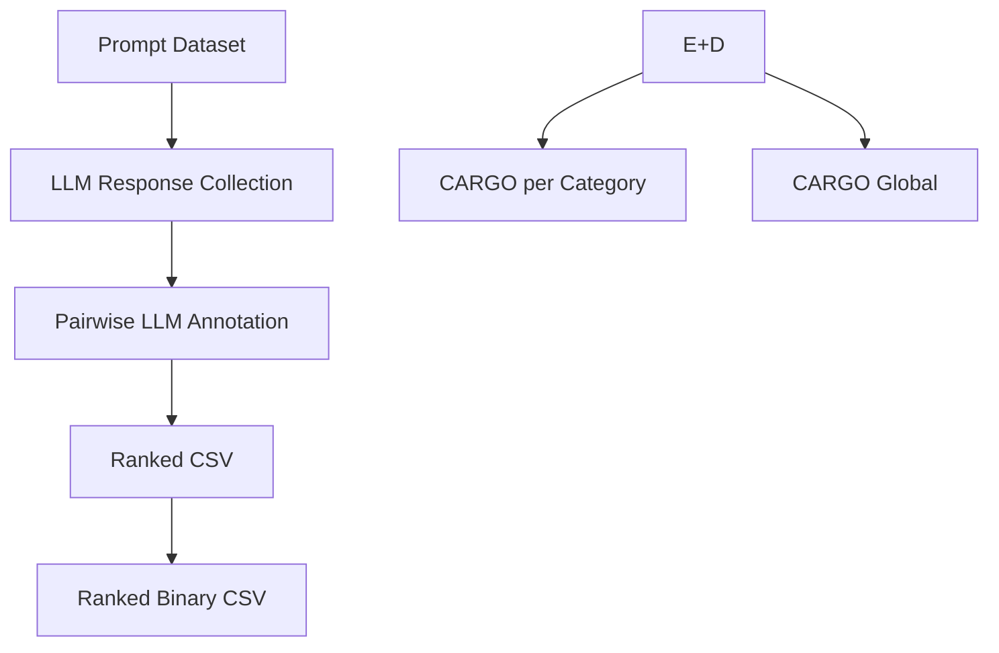

# 🚚 CARGO: Confidence-Aware Routing of Large Language Models

**CARGO** (**Category-Aware Routing with Gap-based Optimization**) is a lightweight, **confidence-aware router** for large language models (LLMs). It selects the best expert model per prompt using a two-stage strategy:

1. A **regression model** scores LLM responses using prompt embeddings.  
2. If the **top two scores are too close**, a **classifier** breaks the tie.  

CARGO achieves **up to 86% accuracy**, outperforming individual LLMs across coding, math, reasoning, and summarization tasks.

---

## 📦 Features

- ✅ Embedding-based regression scoring  
- 🧠 Binary classifier fallback for tie-breaking  
- 🗃 Supports global and category-specific models  
- 🧪 No human labels required — uses LLM-as-a-judge for annotation  
- 🔌 Easily extendable to new domains or LLMs  

---

## 🔐 Prerequisites

1. **Python ≥ 3.8**  
2. Install dependencies:
```
   pip install -r requirements.txt
```

3. (Optional) If collecting new responses, set your [OpenRouter](https://openrouter.ai) API key:

   ```
   export OPENROUTER_API_KEY="your-api-key"
   ```

---

## 🧭 Pipeline Overview



---

## 📂 Step-by-Step Workflow

---

### 📂 A. Prompt Dataset (**Optional**)

Scripts:

* `Prompt Response Collection/response_collection.py`
* `Prompt Response Collection/merge_responses.py`

**Purpose:**

* Collect responses from multiple LLMs using prompts.
* Merge and deduplicate batches into one dataset.

**Output:**

* `Full Dataset Ranking/Full_dataset_with_id.csv`

---

### 📦 B. LLM Response Collection

📁 **Input file for pipeline start:**

* `Full Dataset Ranking/Full_dataset_with_id.csv`

This file contains all collected responses per prompt and is the entry point for ranking.

**Format:**

```csv
prompt_id,category,model,response
1,math,gpt-4,"The integral of x is (1/2)x² + C"
1,math,claude-2,"Integrating x gives (1/2)x² plus a constant."
```

---

### 🏆 C. Pairwise LLM Annotation → Ranked CSV

Script:

* `Full Dataset Ranking/rank_script_V3.py`

**What it does:**

* Compares multiple responses per prompt.
* Generates rankings using pairwise wins/losses, heuristics, or LLM-as-a-judge scoring.

**Output:**

* `Full Dataset Ranking/ranked_responses_final.csv`

---

### ✅ D. Ranked CSV

📁 File:

* `Full Dataset Ranking/ranked_responses_final.csv`
  (also duplicated in `Training/ranked_responses_final.csv`)

This is the **training supervision file** for regression/classification models.

---

### 🧬 E. Ranked Binary CSV (Pairwise Format)

Notebook:

* `Training/Binary Dataet.ipynb`

**Inputs:**

* `Full Dataset Ranking/ranked_responses_final.csv`
* `Training/df_processed.pkl` (optional metadata file)

**What it does:**

* Builds all response pairs per prompt.
* Labels `1` if A ranked higher than B, else `0`.

**Output:**

* `Training/df_pairwise_v2.pkl`

**Format (pairwise rows):**

```pkl
{
  prompt_id: 1,
  model_A: "gpt-4",
  model_B: "claude-2",
  label: 1   # A wins
}
```

---

### 🏗️ F1. CARGO per Category (Regressor)

Notebook:

* `Training/train_category_NEW.ipynb`

**Inputs:**

* `Training/df_pairwise_v2.pkl`
* `Training/ranked_responses_final.csv`

**Process:**

* Train regression models per category (Math, Code, Reasoning, English, Summaries).
* Apply τ-gap threshold logic.
* Evaluate and plot accuracy vs τ.

---

### 🧪 F2. CARGO Global (Regressor)

Notebook:

* `Training/train_global_Regressor.ipynb`

**Inputs:**

* `Training/df_pairwise_v2.pkl`
* `Training/ranked_responses_final.csv`

**Process:**

* Train a single global regressor across all categories.
* Apply τ-gap threshold logic.
* Evaluate global performance and plot results.

---

## 📊 Scalability Experiments

Validation datasets with human labels are provided for benchmarking:

* `Scalability Experiments/250_human_label.csv`
* `Scalability Experiments/experiment1_human_label.csv`
* `Scalability Experiments/experiment2_human_label.csv`

These allow evaluation of routing accuracy against human judgments.

---

## 📁 Repository Structure

```
C:.
│   README.md
│   requirements.txt
│
├───Full Dataset Ranking
│       Full_dataset_with_id.csv
│       ranked_responses_final.csv
│       rank_script_V3.py
│
├───Prompt Response Collection
│       merge_responses.py
│       response_collection.py
│
├───Scalability Experiments
│       250_human_label.csv
│       experiment1_human_label.csv
│       experiment2_human_label.csv
│
└───Training
        Binary Dataet.ipynb
        df_pairwise.pkl
        df_pairwise_v2.pkl
        ranked_responses_final.csv
        train_category_NEW.ipynb
        train_global_Regressor.ipynb
```

---

## 🚀 Extending CARGO

* Add new LLMs by updating the response collection script.
* Add new categories for specialized regressors.
* Tune τ-thresholds for different confidence levels.

---

## 👨‍🔬 Citation

If you use CARGO in your work, please cite:
```
@inproceedings{barrak2025cargo,
  title     = {CARGO: A Framework for Confidence-Aware Routing of Large Language Models},
  author    = {Barrak, Amine and Fourati, Yosr and Olchawa, Michael and Ksontini, Emna and Zoghlami, Khalil},
  booktitle = {Proceedings of the International Conference on Collaborative Advances in Software and COmputiNg (CASCON)},
  year      = {2025},
  pages     = {1--10}
}
```


